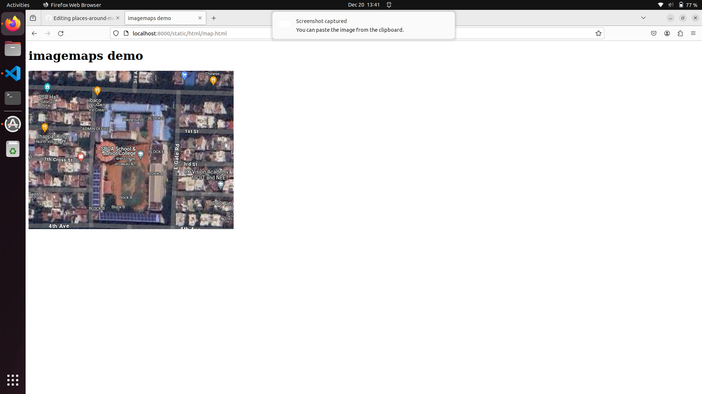
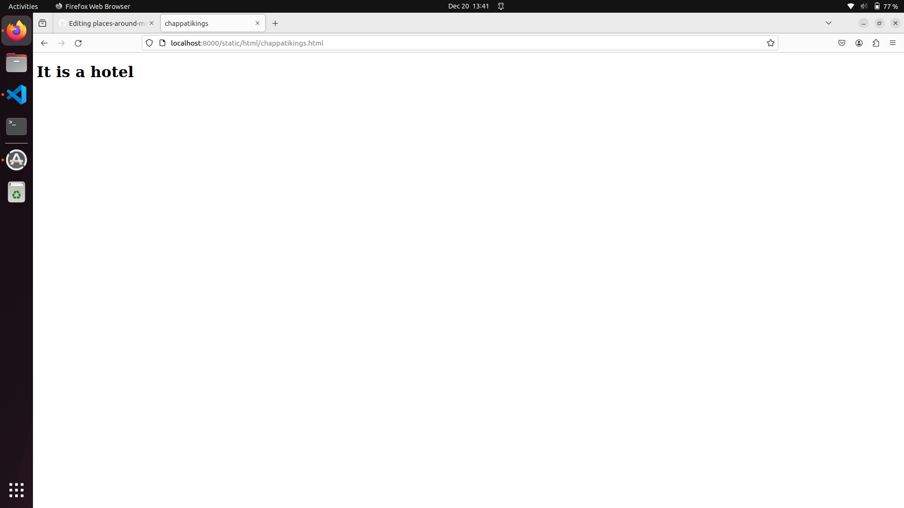
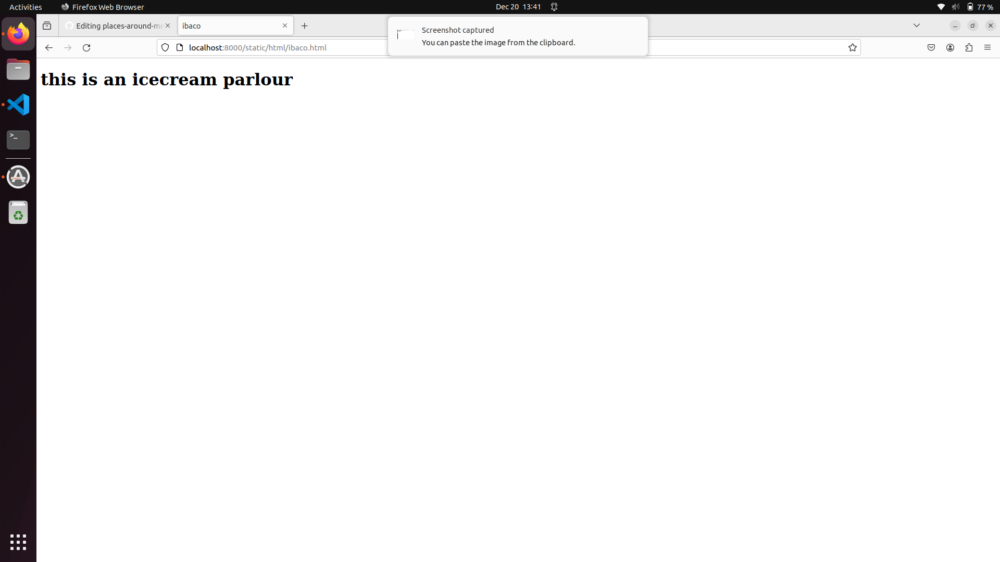
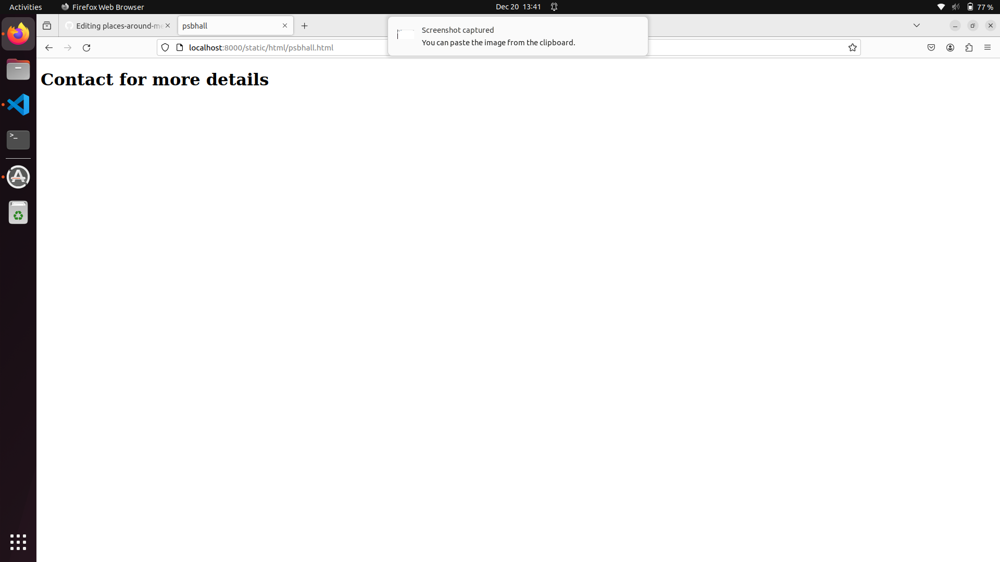
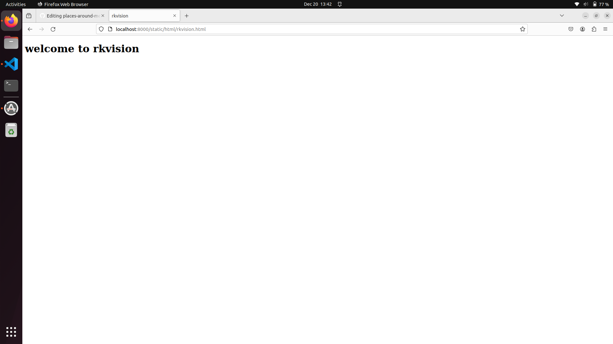

# Places Around Me
## AIM:
To develop a website to display details about the places around my house.

## Design Steps:

### Step 1:
Creating Repository:

First, a path to make a folder where git needs to be created is identified.
Fork the repository (https://github/gowriganeshns/places-around-me)
Clone the repository

git clone https://github.com/SVENGADAKRISHNAN/places-around-me 

After cloning the folder with the repository name places-around-me will be created
### Step 2:
cd serverside

django-admin startproj myproj

>Then move into the folder myproj where manage.py file is located. Now give the commands to create myapp

python3 manage.py startapp myapp

.Then change the necessary settings in the settings.py.

from pathlib import Path
import os

ALLOWED_HOSTS = ['*']

INSTALLED_APPS = [
'django.contrib.admin',
'django.contrib.auth',
'django.contrib.contenttypes',
'django.contrib.sessions',
'django.contrib.messages',
'django.contrib.staticfiles',
'myapp'
]
STATICFILES_DIR=[
os.path.join(BASE_DIR,'static')
]

>Now go to /home/sec/FWAD/ex04/places-around-me/myproj and type the following commands
 
 1. mkdir static
 2. cd static
 3. mkdir html
 4. cd html
 5. touch chappatikings.html
 6. touch ibaco.html
 7. touch psbhall.html
 8. touch rkvision.html
 9. touch sboajc.html
 10.touch map.html

 >Select the image file required for the project, go to imagemap.org and use the tools provided to create html code for image mapping, and paste the code in map.html
## Code:
1.map.html
<!DOCTYPE html>
<html>
    <head>
        <title>
            imagemaps demo
        </title>
    </head>
    <body>
        <h1> imagemaps demo</h1>
        
        <map name="image_map">
            <area alt="psbhall" title="psbhall" href="psbhall.html" coords="40,44,74,81" shape="rect">
            <area alt="ibaco" title="ibaco" href="ibaco.html" coords="170,45,202,79" shape="rect">
            <area alt="chappatikings" title="chappatikings" href="chappatikings.html" coords="58,149,29" shape="circle">
            <area alt="sboajc" title="sboajc" href="sboajc.html" coords="327,218,40" shape="circle">
            <area alt="rkvision" title="rkvision" href="rkvision.html" coords="536,290,38" shape="circle">
        </map>
    </body>
</html>
2.chappatikings.html
<!DOCTYPE html>
<html>
    <head>
        <title>
            chappatikings
        </title>
    </head>
    <body>
        <h1>It is a hotel</h1>
    </body>
</html>
3.ibaco.html
<!DOCTYPE html>
<html>
    <head>
        <title>
            ibaco
        </title>
    </head>
    <body>
        <h1>this is an icecream parlour</h1>
    </body>
</html>
4.psbhall.html
<!DOCTYPE html>
<html>
    <head>
        <title>
            psbhall
        </title>
    </head>
    <body>
        <h1>Contact for more details</h1>
    </body>
</html>
5.rkvision.html
<!DOCTYPE html>
<html>
    <head>
        <title>
            rkvision
        </title>
    </head>
    <body>
        <h1>welcome to rkvision</h1>
    </body>
</html>
6.sboajc.html
<!DOCTYPE html>
<html>
    <head>
        <title>
            sboajc
        </title>
    </head>
    <body>
        <h1>best school</h1>
    </body>
</html>

## Output:

Imagemap interface:

Chappatikings interface:

Ibaco interface:

Psbhall interface:

Rkvision interface:

Sboajc interface:

## Result:
Imagemap interface has been created succesfully.
